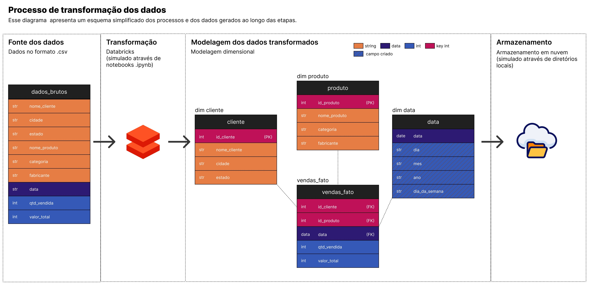

# 🚀 Desafio Técnico - Gaudium

O desafio consiste em aplicar modelagem dimensional a partir de uma tabela consolidada com informações brutas, utilizando a abordagem de fato e dimensões.

## 📁 Estrutura dos dados

Arquivo de entrada: `Dados brutos.csv`
| Coluna       | Tipo |
|--------------|------|
| nome_cliente | str  |
| cidade       | str  |
| estado       | str  |
| nome_produto | str  |
| categoria    | str  |
| fabricante   | str  |
| data         | date |
| qtd_vendida  | int  |
| valor_total  | int  |

Durante a leitura do arquivo no PySpark, a opção `inferSchema=True` foi utilizada, permitindo a identificação automática e correta dos tipos de dados.

## 📋 Identificação de entidades e fatos

A partir de uma análise inicial, foram identificadas três principais dimensões: **clientes**, **produtos** e **datas**. Os fatos estão associados às medidas de quantidade vendida e valor total.

### Tabelas de Dimensão: 

#### Cliente

A dimensão de clientes é composta por nome, cidade e estado. A identificação única de cada cliente foi gerada por meio de um hash da combinação desses três campos.

| Coluna       | Tipo |
|--------------|------|
| id_cliente   | int  |
| nome_cliente | str  |
| cidade       | str  |
| estado       | str  |

#### Produtos

A dimensão de produtos utiliza o nome do produto e o fabricante como identificadores únicos, também com o ID sendo um hash da combinação desses campos.

| Coluna       | Tipo |
|--------------|------|
| id_produto   | int  |
| nome_produto | str  |
| categoria       | str  |
| fabricante       | str  |

#### Datas

A dimensão de datas foi construída com base no intervalo entre a primeira e a última data de compra registrada. Ela inclui colunas adicionais úteis para análises temporais.

| Coluna       | Tipo |
|--------------|------|
| data   | date  |
| dia | int  |
| mes       | int  |
|    ano    | int  |
|    dia_da_semana    | int  |

### A tabela fato criada:

#### Vendas fato

A tabela fato de vendas centraliza os dados relacionando as três dimensões com as métricas de interesse. A granularidade adotada é por cliente, produto e data.

| Coluna       | Tipo |
|--------------|------|
| data   | date  |
| id_cliente | int  |
| id_produto       | int  |
|    qtde_vendida    | int  |
|    valor_total    | int  |

## 🏭 Diagrama do modelo e processo

O diagrama abaixo representa de forma simplificada o fluxo de transformação dos dados neste projeto. Ele não segue uma estrutura formal de diagramação de processos ETL, pois o objetivo é apenas ilustrar, de maneira clara e objetiva, as etapas específicas adotadas neste caso.



## ▶️ Como executar

### Código principal
Passos:

- Certifique-se de ter um ambiente com suporte ao PySpark.
- Coloque os arquivos `main.py` e config.toml no ambiente.
- Faça o upload do arquivo `.csv`. Por padrão, o script espera que o arquivo esteja no diretório `data/raw/`, localizado no mesmo nível do main.py. Esse caminho pode ser alterado no arquivo de configuração (`config.toml`).
- Execute o arquivo `main.py`.

Os arquivos de saída serão gerados nos diretórios especificados no config.toml (por padrão, em `data/processed/`).

---

### Código notebook (`notebooks/modelagem.ipynb`)

Essa versão foi utilizada para testar individualmente cada base de dados e pode ser útil para investigar etapas específicas do processo de transformação.

- Suba o notebook e o arquivo `.csv` em um ambiente com suporte ao pyspark
- Execute as células sequencialmente

Observação:

Os caminhos dos arquivos estão escritos conforme a estrutura do repositório. Para maior flexibilidade, esses caminhos podem ser modificados conforme necessário

## 🛠 Tecnologias utilizadas

- PySpark
- Spark SQL
- Databricks ou outra plataforma equivalente (Simulado via notebooks para facilitar a análise e testagem dos dados)
- Git e GitHub
- Figma (Utilizado na criação dos diagramas que ilustram o modelo dimensional e o fluxo de transformação dos dados.)

## 📂 Arquivos no repositório

A estrutura de arquivos do repositório

- `imgs/*.jpg`
    - Imagens utilizadas no `README.md`
- `notebooks/modelagem.ipynb`
    - Notebook utilizado para gerar os dados individualmente. Recomendado principalmente para testar funções e transformações específicas em uma das tabelas
- `notebooks/testing.ipynb`
    - Notebook utilizado para realizar alguns testes de integridade dos dados gerados
- `main.py`
    - Script principal responsável pela orquestração da geração das tabelas a partir dos dados brutos.
- `config.toml`
    - Arquivo de configuração do script `main.py`. Nele é possível:
        1. Alterar os caminhos de entrada e saída dos arquivos;
        2. Definir quais arquivos devem ser consolidados;
        3. Escolher quais colunas devem ser usadas como identificadores únicos.
- `requirements_dev.txt`
    - Lista de pacotes e suas versões utilizados no desenvolvimento do projeto

### Arquivos gerados
Os arquivos de saída foram organizados para simular um processo de ETL. A estrutura segue o seguinte formato:

```
data
├───processed
│   └── cliente
│       ├── clientes_YYYYmmmdd.csv
│       └── clientes.csv
│   └── datas
│       ├── datas_YYYYmmmdd.csv
│       └── datas.csv
│   └── produtos
│       ├── produtos_YYYYmmmdd.csv
│       └── produtos.csv
│   └── vendas_fato.csv
│       ├── vendas_fato_YYYYmmmdd.csv
│       └── vendas_fato.csv
└───raw
    └─── Dados brutos.csv
```

## ✅ Observações

- Para cada grupo de dados, são gerados dois arquivos:
    - Uma versão com o nome fixo (ex: `clientes.csv`), que representa sempre a versão mais recente;
    - Uma versão com a data de geração no nome (ex: `clientes_YYYYmmmdd.csv`), que pode ser utilizada para controle de versionamento.
- O código não realiza leitura de tabelas previamente criadas. Isso significa que, ao adicionar um novo arquivo com dados, os arquivos de dimensões e fato serão gerados apenas com base nesse novo arquivo, sem incorporar informações de execuções anteriores.
- A utilização de hash para criação das chaves nas tabelas de dimensões foi adotada com o objetivo de facilitar uma futura implementação mais robusta, em que o histórico e o controle de versionamento de dimensões possam ser mantidos com consistência.